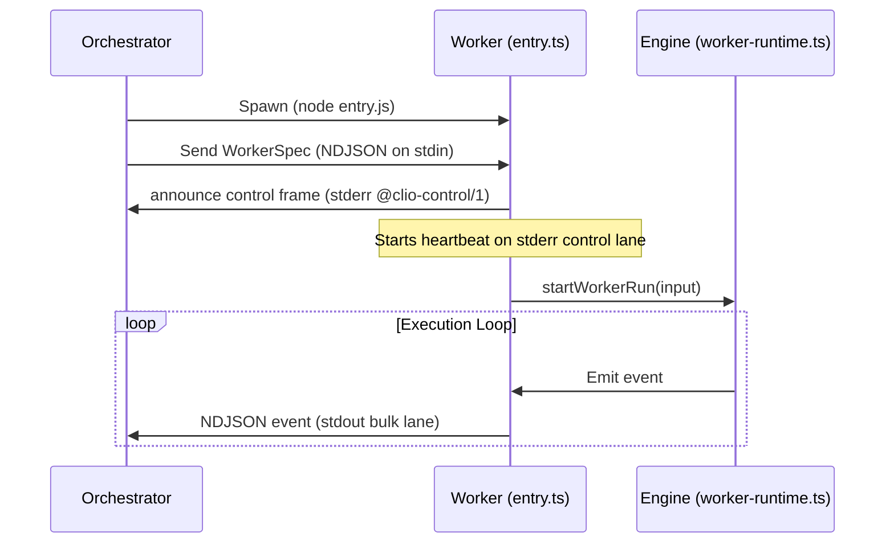
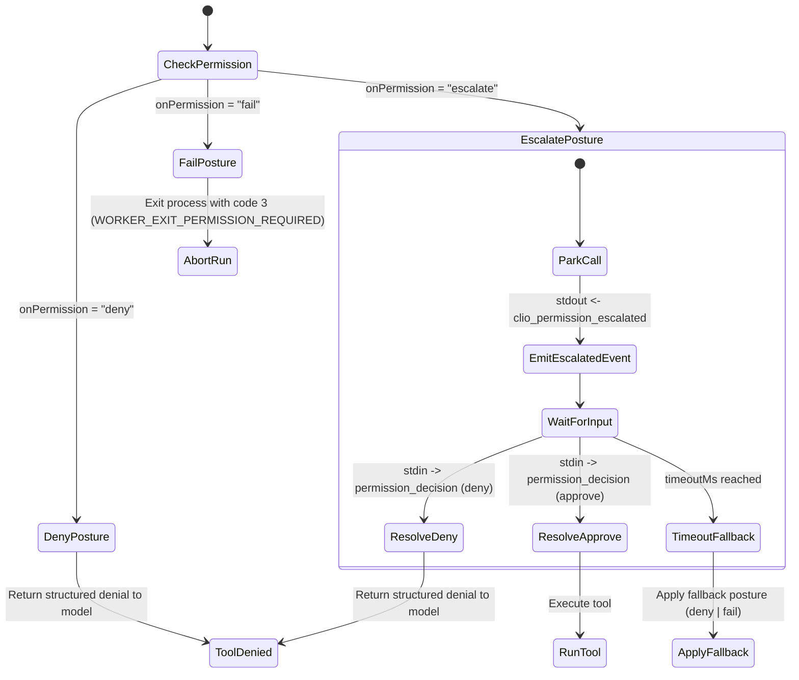

# Worker Dispatch Mechanics

> [!TIP]
> **Interactive Spec Available:** An interactive NDJSON protocol timeline stream and heartbeat watchdog simulator is located at [docs/html/worker_dispatch_blueprint.html](html/worker_dispatch_blueprint.html).

This document describes the design and lifecycle of Clio Coder dispatched workers, focusing on the spawning sequence, execution isolation, the standard input/output NDJSON communication loop, and permission escalation routing.

Source of truth:
- Subprocess entry: [src/worker/entry.ts](../src/worker/entry.ts)
- Input demultiplexing: [src/worker/stdin-demux.ts](../src/worker/stdin-demux.ts)
- Heartbeat loop: [src/worker/heartbeat.ts](../src/worker/heartbeat.ts)
- Spec contracts and exit codes: [src/worker/spec-contract.ts](../src/worker/spec-contract.ts)
- Dispatch orchestrator: [src/domains/dispatch/index.ts](../src/domains/dispatch/index.ts)
- Engine worker runtime: [src/engine/worker-runtime.ts](../src/engine/worker-runtime.ts)

---

## 1. Spawning Sequence & Environment Isolation

When the orchestrator dispatches a task to a fleet agent (such as via the `dispatch` tool or `clio-coder eval` execution), it spins up a child process running the compiled worker entry.

1. **Child Process Creation:**
   The parent process spawns a Node.js subprocess pointing to `dist/worker/entry.js`.
2. **Environment Scrubbing:**
   To ensure clean execution, the child process runs with a sanitized environment. The orchestrator scrubs user-interactive flags (e.g., `CLIO_CODER_INTERACTIVE` is removed from `process.env`) to prevent child workers from attempting to mount TUI elements or intercept standard input signals.
3. **Spec Injection & Attestation Handshake:**
   The orchestrator serializes a `WorkerSpec` JSON document and writes it as the very first line of `stdin` to the child worker. Before reaching a model, every worker announces its attestation on the structured stderr control lane (`@clio-control/1 ` prefix): protocol version (`WORKER_PROTOCOL_VERSION = 1`), spec version, process ID, process group ID (or null), host, settings fingerprint, worker-computed spec digest (`specDigest`), runtime ID, target ID, endpoint identity hash (`endpointIdentityHash`), wire model ID, effective tool signature, and bounded node resource facts (labels, CPU count, total memory, free memory, GPU count, VRAM, and resident models). The orchestrator compares each field against the approved plan and terminates a drifting peer instead of running it. Bulk NDJSON on `stdout` is accepted only once that attestation verifies.

---

## 2. Standard Input/Output NDJSON Protocol

Dispatched workers are non-interactive. Coordination between the orchestrator and the worker occurs across two dedicated communication lanes plus standard input:

### 2.1 Worker Output Lanes

Clio divides worker output into two isolated streams to protect control signals from bulk data starvation:

1. **Bulk Lane (`stdout`)**:
   Streams turn execution events as single-line NDJSON objects, capped by `WORKER_BULK_FRAME_MAX_BYTES` (4 MiB). To prevent quadratic payload explosion during streaming, `projectWorkerEventForStdout` (`src/worker/event-projection.ts`) slims `message_update` events by stripping cumulative message snapshots before emission. Major event kinds on stdout include:
   * **Logs / Stream chunks:** Output segments generated by the model during a turn.
   * **Tool Invocation:** Requests to run specific tools.
   * **Permission Escalation:** Emitted when a tool requires approval under the `escalate` posture.
   * **Completion / Failure:** Marks the final state of the run, providing execution receipts.

2. **Control Lane (`stderr`)**:
   Emits out-of-band control frames prefixed by `@clio-control/1 `, capped at `WORKER_CONTROL_FRAME_MAX_BYTES` (16 KiB). Because control frames travel over `stderr`, they bypass backpressured bulk stdout streams and reach orchestrator watchdogs immediately. Control frame kinds include:
   * **Announce:** `{"kind": "announce", "attestation": ...}` sent immediately upon startup.
   * **Heartbeat:** `{"kind": "heartbeat"}` emitted every 1000 milliseconds. The frame carries no timestamp; the orchestrator stamps arrival on its own clock.
   * **Steer / Cancel Acknowledgments:** Confirming reception of stdin control directives.

### 2.2 Worker Input (`stdin`)
The worker entry mounts a custom stdin demultiplexer (`createWorkerStdinDemux`) that parses lines arriving after the initial `WorkerSpec`. It processes two types of JSON messages:
1. **Steering Commands:**
   `{"type": "steer", "text": "guidance message", "sequence": 1}`
   Instructs a live-input HTTP or SDK worker to alter course. Its runtime emits
   the receipt-bearing `clio_steer_received` event only after accepting the
   message for the next turn boundary. Single-shot subprocess runtimes install
   no steering handler, drop unexpected guidance without claiming receipt, and
   are not offered steering by the dispatch contract or TUI.
2. **Permission Decisions:**
   `{"type": "permission_decision", "requestId": "req-xxx", "decision": "approve"|"deny"}`
   Resolves a parked tool call that was escalated to the operator.

Any stdin chunk that is not a valid JSON structure matching these schemas is logged as a dropped line and does not crash the worker.

---

## 3. Heartbeats and the Watchdog

Even when a model is processing a long thinking phase or generating a heavy output, the worker must prove it is alive to prevent the parent orchestrator's watchdog from reclaiming it.

* **Emission:** The heartbeat loop (`startWorkerHeartbeat` in `src/worker/heartbeat.ts`) writes a heartbeat control frame (`{"kind": "heartbeat"}`) to the `stderr` control lane every 1000 milliseconds.
* **Stream Isolation:** Because heartbeats ride the control lane rather than `stdout`, a large bulk output or queued tool result cannot starve or delay the watchdog check.
* **Non-Blocking Timer:** The heartbeat timer interval is explicitly `.unref()`'d, ensuring the Node.js runtime is not kept alive past the natural lifetime of the worker run.
* **Termination:** Once `startWorkerRun` resolves, the timer is cleared before returning the worker's exit code.

---

## 4. Permission Escalation and Parking

When a tool requires explicit confirmation (for example executing a mutating file change or running a bash command at `suggest` autonomy), the worker evaluates `onPermission`:

1. **Deny:** Immediately returns a structured denial to the model, allowing the run to continue without making the call.
2. **Fail:** Terminate the run immediately, exiting the worker subprocess with exit code `3` (`WORKER_EXIT_PERMISSION_REQUIRED`).
3. **Escalate (Parking Loop):**
   - The worker parks the tool execution thread.
   - It generates a unique `requestId` and emits a `clio_permission_escalated` event to `stdout`.
   - The parent process intercepts this event, displays the approval prompt in the interactive TUI, and waits for the operator.
   - If the operator selects approve or deny, the parent writes `{"type":"permission_decision", "requestId":"...", "decision":"..."}` to the worker's `stdin`.
   - The demuxer resolves the parked promise, resuming tool execution.
   - **Timeout Safety:** If no decision arrives within `escalation.timeoutMs` (default `120000` ms), the worker resumes and applies the `escalation.fallback` posture (default `deny`). If running headlessly (no operator attached) or on runtimes that cannot support park loops, the posture collapses to the fallback immediately.

---

## 5. Assignment-aware retry and failover

A worker process produces one immutable **attempt**. Dispatch groups attempts
under a logical **assignment** whose id is the first attempt's
`lineage.rootRunId`. Attached and batch `finalPromise` handles resolve to the
terminal attempt receipt, not to an earlier failure that happened to trigger a
retry. Receipt bytes and integrity versions remain unchanged; assignment state
is maintained separately in `assignments.json` with the attempt ids, terminal
run id, and status.

Detached `monitor collect` resolves the assignment's terminal run and returns
its complete `attemptRunIds` history. `status`, `wait`, `steer`, permission
resolution, and cancellation also accept the assignment id and address the
current attempt. Cancellation prevents queued or future attempts. Pipelines
therefore receive terminal fallback output as their next-stage input.

The assignment also owns the event stream. `dispatch()` returns a single
stream carrying every attempt's frames in order, separated by a synthetic
`attempt_start` frame (`attempt`, `runId`, `previousRunId`, `reason`). The
stream ends when the assignment settles, not when one attempt's worker exits,
so a consumer that drains it has seen exactly the run the terminal receipt
describes. A canceled assignment ends its stream immediately.

Retry timing is governed by `fleet.retry.maxRetries` and exponential backoff alone.
Target cooldowns gate *new* dispatches to a known-bad target and are not
applied to retries of an in-flight assignment, whose retry budget already
bounds it. A retry refused at admission settles the assignment failed and
records the denial reason in the assignment's `outcomeDetail`.

Retry also requires evidence that reusing the same checkout is safe. Each
receipt seals `safety.toolTelemetry`: coverage is `complete`, `partial`, or
`unavailable`, with ingestion errors and unmatched tool starts preserved.
Dispatch suppresses automatic retry after an executed state-changing call,
after an unfinished state-changing call, or when an opaque mutation-capable
runtime cannot prove that the failed attempt left the workspace unchanged.
Claude CLI runs technically constrained to read-only tools retain retries;
mutation-capable subprocess and ACP runs fail closed until isolated retry
workspaces exist.

Failover modes are:

- `none`: exact pins remain fail-closed; retries can only repeat the same tuple.
- `approved`: candidates must be exact members of the operator-approved
  agent/target/model/node envelope.
- `automatic`: typed failures may replace only implicated route parts. Node
  channel failure excludes the node; target rate limiting excludes the target.

Operator cancellation, policy rejection, permission refusal, and deterministic
task failures do not retry. The first three are neutral to target/node
infrastructure breakers.

### 5.1 Failure Taxonomy & Route Exclusion

The coordinator classifies failures into 13 explicit categories (`src/domains/dispatch/failure-classification.ts`) to determine which route parts (`agent`, `target`, `model`, `node`, `runtime`) are excluded during an assignment retry:

| Failure Class | Trigger Pattern / Exit Code | Excluded Route Part | Retryable? |
| --- | --- | --- | --- |
| `operator-cancel` | User abort, `canceled` outcome | None (Neutral) | No |
| `policy` | Policy denial, `denied_by_policy` | None (Neutral) | No |
| `permission` | `WORKER_EXIT_PERMISSION_REQUIRED` (code 3) | None (Neutral) | No |
| `deterministic-task` | `isDeterministicOutcomeCode()` (e.g. `result_contract_exhausted`) | None | No |
| `model-quality` | Quality gate failure | `agent, model` | Yes |
| `node-channel` | Stall killed, `spawn_failed`, SSH exit code 255 | `node` | Yes |
| `node-resource` | VRAM/GPU OOM error pattern | `node` | Yes |
| `target-auth` | HTTP 401/403, invalid API key | `target` | Yes |
| `target-rate-limit` | HTTP 429, rate limit error pattern | `target` | Yes (Delayed) |
| `target-transient` | Timeout, HTTP 502/503/504 | `target` | Yes |
| `capacity` | Queue full / overload pattern | `node` | Yes |
| `worker-runtime` | `failed` outcome after more-specific classifiers do not match | `runtime` | Yes |
| `internal` | No more-specific termination evidence; coordinator fallback | None | Yes |

### 5.2 Canonical Receipt Integrity Serialization

Receipts carry exactly one integrity version (`RUN_RECEIPT_INTEGRITY_VERSION = 19`); any other version is invalid. It computes a cryptographic SHA-256 digest over a strictly sorted, canonical JSON representation (`serializeCanonical` in `src/domains/dispatch/receipt-integrity.ts`).

- **Object Key Sorting**: Keys are sorted lexicographically before serialization (`Object.keys(obj).sort()`).
- **Strict Primitive Handling**: `undefined` object properties are omitted; non-finite numbers (`NaN`, `Infinity`) or `bigint` throw an explicit serialization error.
- **Coverage**: Includes every current receipt field and reconstructible ledger field, including route intent/decision/quality, execution role, worker identity, result-contract conformance, node/reroute/gate/plan/council provenance, briefing, steering, task worktree application, and `outcomeCode`.

Integrity is only the artifact-integrity axis of the canonical trust status.
The other axes are validation grounding, independent review, context
provenance, autonomy enforcement, and completion evidence. Sealing proves that
the receipt matches its covered ledger facts; it does not verify correctness,
establish context authorship, turn a correlated review into an independent
one, or prove completion. Every non-absent canonical fact retains a named
source and authority plus bounded references to detailed artifacts. The full
state vocabulary and compatibility map are documented in
[`evidence-and-memory.md`](evidence-and-memory.md#canonical-trust-status).

### 5.3 Acceptance Coverage

The assignment contract's acceptance scenarios map to deterministic contract
tests as follows:

| # | Scenario | Contract test |
| --- | --- | --- |
| 1 | Remote stall, approved local fallback, attached success | `dispatch-envelope.test.ts`: "falls back from remote to local only within an approved envelope" |
| 2 | Detached collection returns successful terminal fallback | `dispatch-assignment-detached.test.ts`: "collects the terminal retry…" |
| 3 | Pipeline consumes terminal fallback output | `dispatch-assignment-detached.test.ts`: "threads the successful retry output…" |
| 4 | Failed attempt remains visible and integrity-verifiable | `dispatch-assignment.test.ts`: "resolves attached dispatch…" (also covered by detached collection) |
| 5 | Cancellation starts no retry | `dispatch-assignment.test.ts`: "canceling the root attempt starts no retry" |
| 6 | Cancellation does not cool the target | `dispatch-failure-class.test.ts`: "keeps cancellation and permission neutral…" |
| 7 | Permission/policy rejection is retry- and breaker-neutral | `dispatch-failure-class.test.ts`: classification/decision table and neutral-target test |
| 8 | Node-channel failure changes node but retains model | `dispatch-failure-class.test.ts`: "moves only the node…" |
| 9 | Rate limit retains agent/model and delays or changes target | `dispatch-failure-class.test.ts`: "changes target after rate limiting…" |
| 10 | Exhaustion returns one failure with all attempt receipts | `dispatch-assignment.test.ts`: "settles exhausted retries…" |
| 11 | Exact manual pin never falls back | `dispatch-envelope.test.ts`: "keeps a manual exact pin fail-closed…" |
| 12 | Approved envelope never spawns outside its candidate list | `dispatch-envelope.test.ts`: "settles failed instead of spawning an unlisted candidate" |

## 6. Worker Exit Codes

The child process exits with specific status codes to signal run outcomes to the orchestrator:
* **`0`**: The worker process completed without a runtime error; dispatch still requires a nonempty receipt-sealed final answer before classifying the run as successful.
* **`2`**: Worker runtime initialization failed (e.g., target runtime not registered, or `WorkerSpec` invalid/mismatched).
* **`3` (`WORKER_EXIT_PERMISSION_REQUIRED`)**: The run aborted because a tool required permission and `onPermission` was set to `fail` (or timed out to a `fail` fallback).
* **Other (e.g., `1` or uncaught exceptions)**: Represents an unhandled crash or internal error within the runner.
