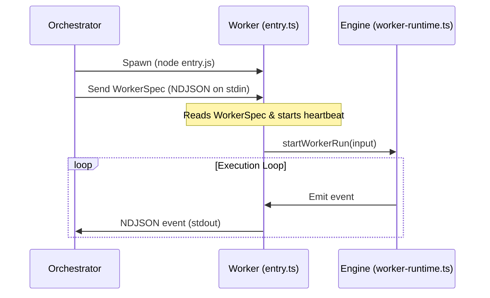
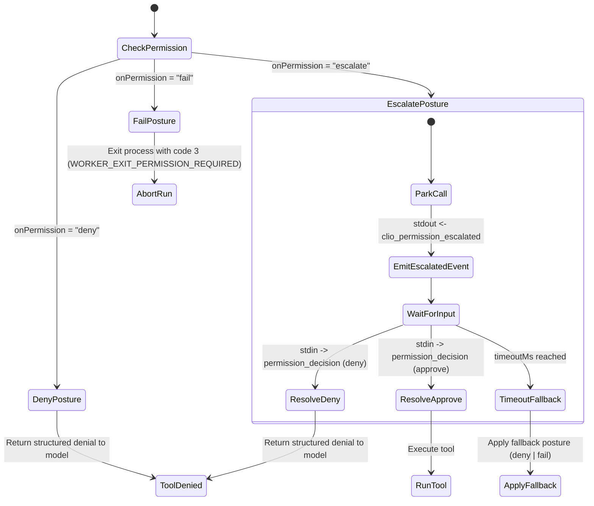

# Worker Dispatch Mechanics

This document describes the design and lifecycle of Clio Coder dispatched workers, focusing on the spawning sequence, execution isolation, the standard input/output NDJSON communication loop, and permission escalation routing.

Source of truth:
- Subprocess entry: [src/worker/entry.ts](../src/worker/entry.ts)
- Input demultiplexing: [src/worker/stdin-demux.ts](../src/worker/stdin-demux.ts)
- Heartbeat loop: [src/worker/heartbeat.ts](../src/worker/heartbeat.ts)
- Spec contracts and exit codes: [src/worker/spec-contract.ts](../src/worker/spec-contract.ts)
- Dispatch orchestrator: [src/domains/dispatch/index.ts](../src/domains/dispatch/index.ts)
- Engine worker runtime: [src/engine/worker-runtime.ts](../src/engine/worker-runtime.ts)

---

## 1. Spawning Sequence & Environment Isolation

When the orchestrator dispatches a task to a fleet agent (such as via the `dispatch` tool or `clio eval` execution), it spins up a child process running the compiled worker entry.

1. **Child Process Creation:**
   The parent process spawns a Node.js subprocess pointing to `dist/worker/entry.js`.
2. **Environment Scrubbing:**
   To ensure clean execution, the child process runs with a sanitized environment. The orchestrator scrubs user-interactive flags (e.g., `CLIO_INTERACTIVE` is removed from `process.env`) to prevent child workers from attempting to mount TUI elements or intercept standard input signals.
3. **Spec Injection:**
   The orchestrator serializes a `WorkerSpec` JSON document and writes it as the very first line of `stdin` to the child worker, immediately followed by a newline (`\n`).

---

## 2. Standard Input/Output NDJSON Protocol

Dispatched workers are completely non-interactive. All coordination between the orchestrator and the worker occurs via Newline-Delimited JSON (NDJSON) over standard streams.

### 2.1 Worker Output (`stdout`)
The worker streams structural events as single-line JSON objects to `stdout`. Major event types include:
* **Heartbeat:** `{"type": "heartbeat", "at": 1720186123000}`
* **Logs / Stream chunks:** Output segments generated by the model during a turn.
* **Tool Invocation:** Requests to run specific tools.
* **Permission Escalation:** Emitted when a tool requires approval under the `escalate` posture.
* **Completion / Failure:** Marks the final state of the run, providing execution receipts.

### 2.2 Worker Input (`stdin`)
The worker entry mounts a custom stdin demultiplexer (`createWorkerStdinDemux`) that parses lines arriving after the initial `WorkerSpec`. It processes two types of JSON messages:
1. **Steering Commands:**
   `{"type": "steer", "text": "guidance message"}`
   Instructs the running worker to alter course. This message is queued and injected into the worker's chat loop at the next turn boundary.
2. **Permission Decisions:**
   `{"type": "permission_decision", "requestId": "req-xxx", "decision": "approve"|"deny"}`
   Resolves a parked tool call that was escalated to the operator.

Any stdin chunk that is not a valid JSON structure matching these schemas is logged as a dropped line and does not crash the worker.

---

## 3. Heartbeats and the Watchdog

Even when a model is processing a long thinking phase or generating a heavy output, the worker must prove it is alive to prevent the parent orchestrator's watchdog from reclaiming it.

* **Emission:** The heartbeat loop (`startWorkerHeartbeat`) writes a heartbeat event to `stdout` every 1000 milliseconds.
* **Non-Blocking Timer:** The heartbeat timer interval is explicitly `.unref()`'d, ensuring the Node.js runtime is not kept alive past the natural lifetime of the worker run.
* **Termination:** Once `startWorkerRun` resolves, the timer is cleared before returning the worker's exit code.

---

## 4. Permission Escalation and Parking

When a tool requires explicit confirmation (e.g. executing a mutating file change or running a bash command at `suggest` autonomy), the worker evaluates `onPermission`:

1. **Deny:** Immediately returns a structured denial to the model, allowing the run to continue without making the call.
2. **Fail:** Terminate the run immediately, exiting the worker subprocess with exit code `3` (`WORKER_EXIT_PERMISSION_REQUIRED`).
3. **Escalate (Parking Loop):**
   - The worker parks the tool execution thread.
   - It generates a unique `requestId` and emits a `clio_permission_escalated` event to `stdout`.
   - The parent process intercepts this event, displays the approval prompt in the interactive TUI, and waits for the operator.
   - If the operator selects approve or deny, the parent writes `{"type":"permission_decision", "requestId":"...", "decision":"..."}` to the worker's `stdin`.
   - The demuxer resolves the parked promise, resuming tool execution.
   - **Timeout Safety:** If no decision arrives within `escalation.timeoutMs` (default `120000` ms), the worker resumes and applies the `escalation.fallback` posture (default `deny`). If running headlessly (no operator attached) or on runtimes that cannot support park loops, the posture collapses to the fallback immediately.

---

## 5. Worker Exit Codes

The child process exits with specific status codes to signal run outcomes to the orchestrator:
* **`0`**: The worker task completed successfully (e.g., reached the target milestone or generated the requested artifact).
* **`2`**: Worker runtime initialization failed (e.g., target runtime not registered, or `WorkerSpec` invalid/mismatched).
* **`3` (`WORKER_EXIT_PERMISSION_REQUIRED`)**: The run aborted because a tool required permission and `onPermission` was set to `fail` (or timed out to a `fail` fallback).
* **Other (e.g., `1` or uncaught exceptions)**: Represents an unhandled crash or internal error within the runner.
